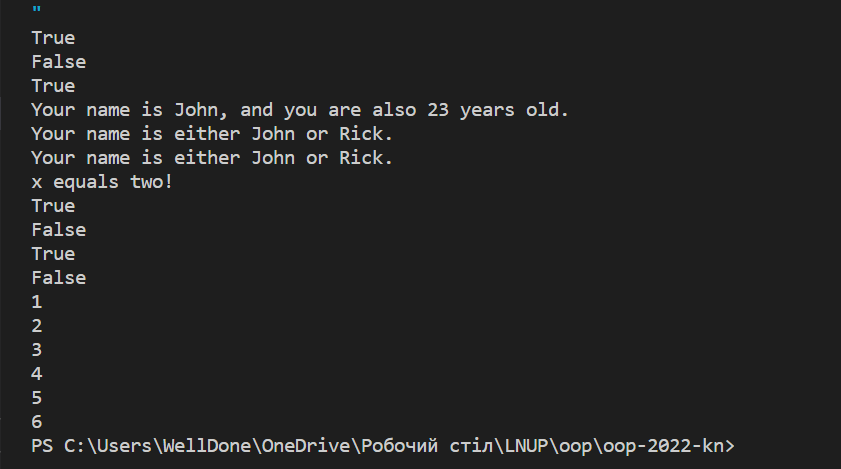
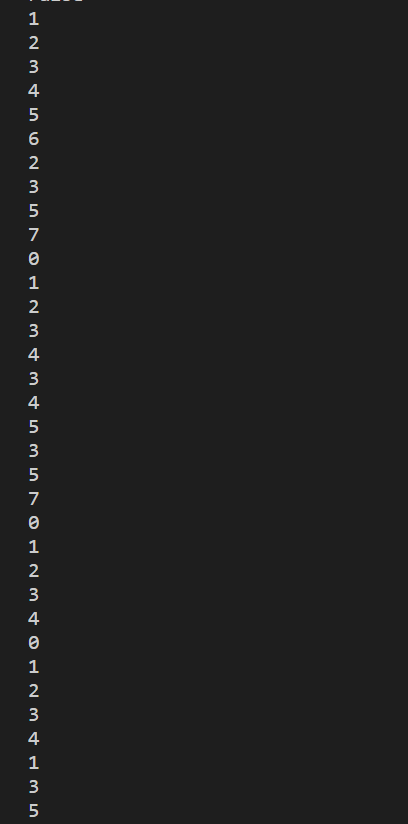
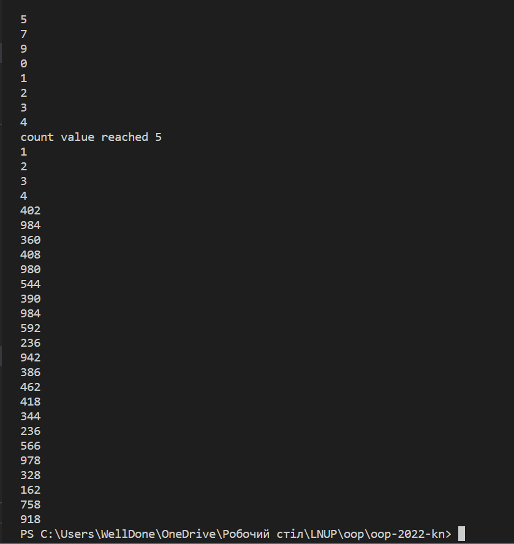

Львівський національний університет природокористування

Факультет механіки, енергетики та інформаційних технологій

Кафедра інформаційних технологій

Звіт з лабораторної роботи №1 на тему:

# Основи структурного програмування в Python 3

Виконав: ст. групи КН-12сп
Батрон Олег

Перевірив: Татомир А. В.

Мета роботи: ознайомлення основними прийомами структурного програмування у Python 3.

## Завдання
1. Засвоїти суть структурного програмування.
2. Навчитися використовувати умовні оператори
3. Познайомитися з операторами булевої логіки в Python 3.
4. Навчитися проектувати складні умови.
5. Опанувати методи роботи з циклами. Навчитися визначати доцільність
застосування різних типів циклів залежно від поставленої задачі.
6. Розв’язати приклади згідно виданих завдань.

## Хід роботи
1. Переглянув та засвоїв суть структурного програмування.
Його суть полягає в тому, що будь-яку програму можна створити за допомогою трьох конструкцій:
послідовне виконання, розгалуження та цикл.
2. Навчився використовувати умовні оператори згідно заданого завдання.
Код:
```python
x = 2
print(x == 2) # prints out True
print(x == 3) # prints out False
print(x < 3) # prints out True

name = "John"
age = 23
if name == "John" and age == 23:
    print("Your name is John, and you are also 23 years old.")

if name == "John" or name == "Rick":
    print("Your name is either John or Rick.")

name = "John"
if name in ["John", "Rick"]:
    print("Your name is either John or Rick.")

statement = False
another_statement = True
if statement is True:
    # do something
    pass
elif another_statement is True: # else if
    # do something else
    pass
else:
    # do another thing
    pass

x = 2
if x == 2:
    print("x equals two!")
else:
    print("x does not equal to two.")

x = [1,2,3]
y = [1,2,3]
print(x == y) # Prints out True
print(x is y) # Prints out False

print(not False) # Prints out True
print((not False) == (False)) # Prints out False

# change this code
number = 16
second_number = 0
first_array = [1,2,3]
second_array = [1,2]

if number > 15:
    print("1")

if first_array:
    print("2")

if len(second_array) == 2:
    print("3")

if len(first_array) + len(second_array) == 5:
    print("4")

if first_array and first_array[0] == 1:
    print("5")

if not second_number:
    print("6")
```
Результати:


3. Вивчив оператори булевої логіки, такі як: дорівнює, більше, менше, не рівне та інші. Виконавши завдання повністю зрозумів їх роботу.

4. Навчився проектувати складні умови за допомогою конструкції 
```python
if <умова>
    <дія>
elif <умова>
    <дія>
else
    <дія>
```

5. Навчився використувувати цикли та обирати потрібний цикл залежно від задачі.
Код:
```python
primes = [2, 3, 5, 7]
for prime in primes:
    print(prime)

# Prints out the numbers 0,1,2,3,4
for x in range(5):
    print(x)

# Prints out 3,4,5
for x in range(3, 6):
    print(x)

# Prints out 3,5,7
for x in range(3, 8, 2):
    print(x)

# Prints out 0,1,2,3,4

count = 0
while count < 5:
    print(count)
    count += 1  # This is the same as count = count + 1

# Prints out 0,1,2,3,4

count = 0
while True:
    print(count)
    count += 1
    if count >= 5:
        break

# Prints out only odd numbers - 1,3,5,7,9
for x in range(10):
    # Check if x is even
    if x % 2 == 0:
        continue
    print(x)

# Prints out 0,1,2,3,4 and then it prints "count value reached 5"

count=0
while(count<5):
    print(count)
    count +=1
else:
    print("count value reached %d" %(count))

# Prints out 1,2,3,4
for i in range(1, 10):
    if(i%5==0):
        break
    print(i)
else:
    print("this is not printed because for loop is terminated because of break but not due to fail in condition")

numbers = [
    951, 402, 984, 651, 360, 69, 408, 319, 601, 485, 980, 507, 725, 547, 544,
    615, 83, 165, 141, 501, 263, 617, 865, 575, 219, 390, 984, 592, 236, 105, 942, 941,
    386, 462, 47, 418, 907, 344, 236, 375, 823, 566, 597, 978, 328, 615, 953, 345,
    399, 162, 758, 219, 918, 237, 412, 566, 826, 248, 866, 950, 626, 949, 687, 217,
    815, 67, 104, 58, 512, 24, 892, 894, 767, 553, 81, 379, 843, 831, 445, 742, 717,
    958, 609, 842, 451, 688, 753, 854, 685, 93, 857, 440, 380, 126, 721, 328, 753, 470,
    743, 527
]

# your code goes here
for number in numbers:
    if number == 237:
        break

    if number % 2 == 1:
        continue

    print(number)
```
Результати



## Висновки:
1. Під час виконання даної роботи я засвоїв суть структурного програмування. Навчився використовувати умовні оператори та цикли. Розібрався та засвоїв булеву логіку, вибір циклу залежно від завдання. Навчився проектувати складні умови.
